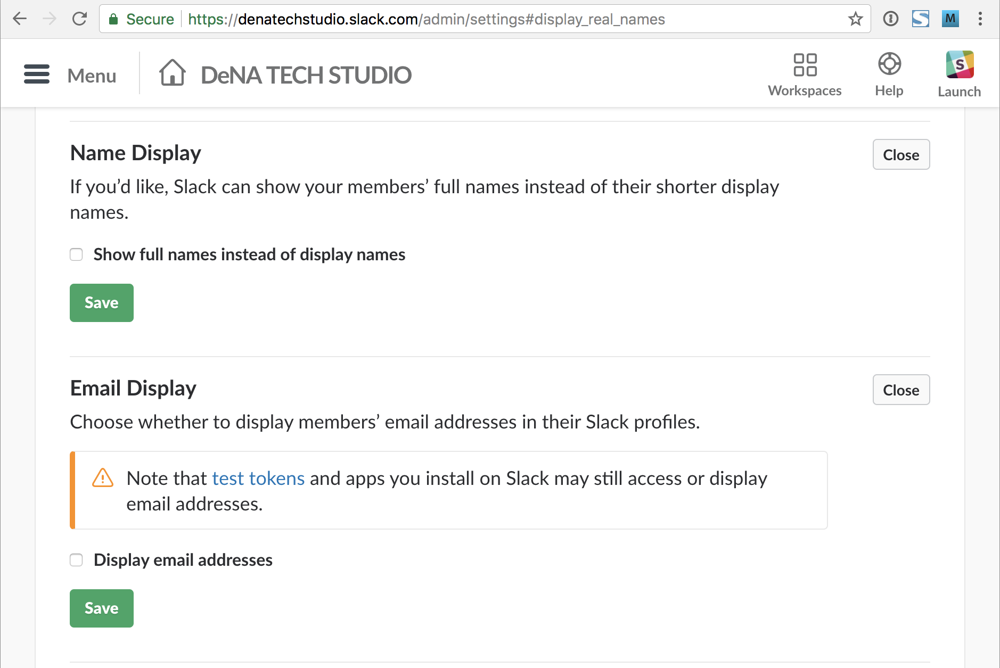
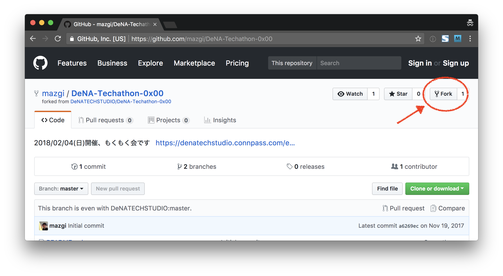
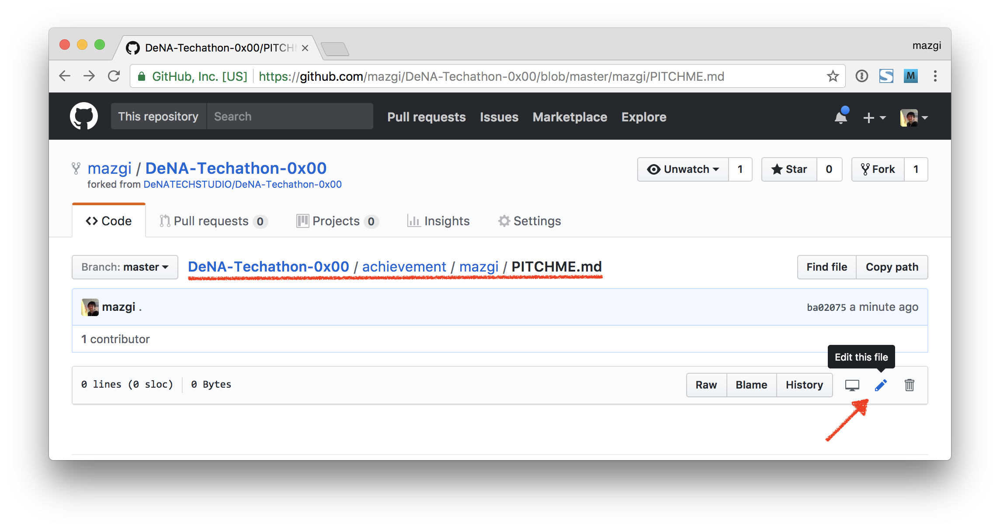
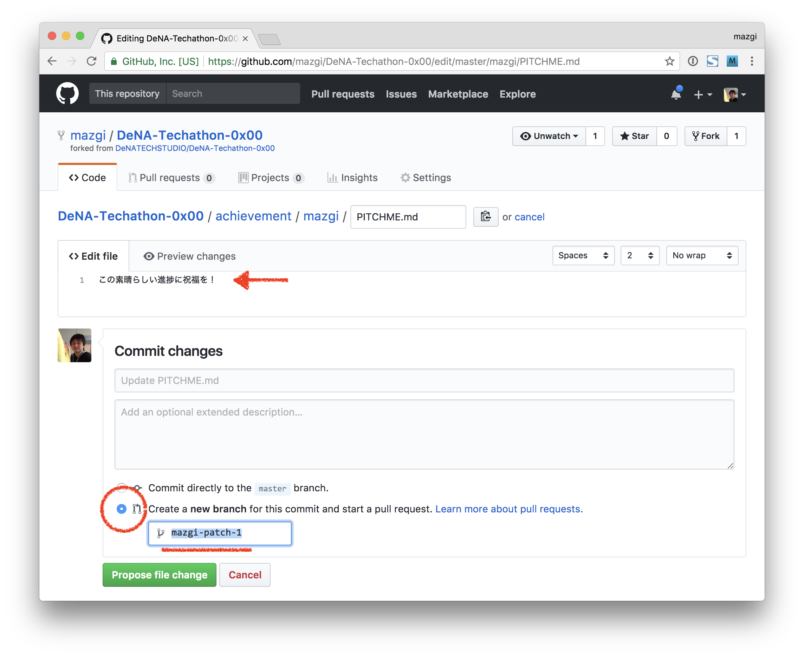
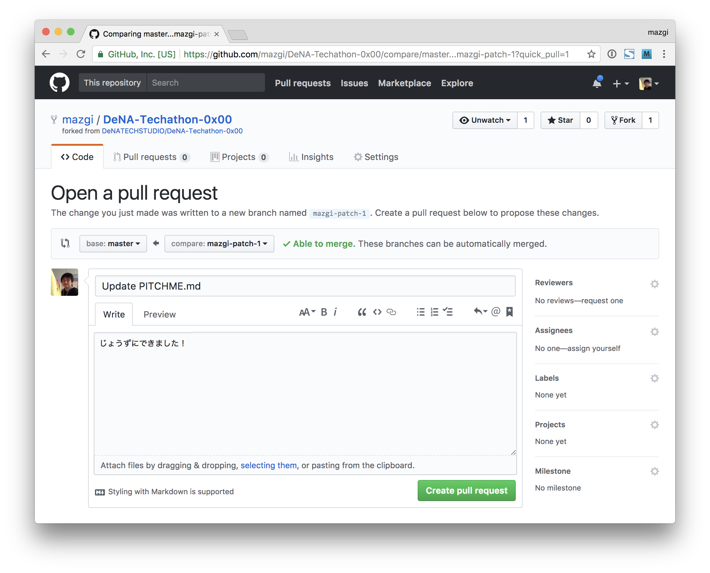

# DeNA-Techathon

### 参加者コミュニケーション用Slackへの参加のお願い(1分)

当日のコミュニケーション用にSlackワークスペースをご用意しております。  
別途ご案内するフォームに従って参加をお願いいたします。  
([Slackin](https://github.com/rauchg/slackin)を使用しています)

なおご入力いただいたメールアドレスはSlackアカウント作成のためだけに使用され、他の目的には使用しません。  
Slack上でもメールアドレスが表示されないよう設定済みです。

また以下の「当日の流れ」や「成果発表準備」もご参照いただきGitHubでのfork等、準備しておいていただくと当日スムーズだと思います。  
GitHubアカウントをお持ちでない方、この機会にGitHubデビューいかがですか :exclamation: :question:

## 当日の流れ

おおまかな流れは、

1. 全員で自己紹介+今日やること宣言
1. もくもくとハック
1. 時間のゆるすかぎり成果発表！

です！  
自分ができる限りのことを集中してやりましょう！

その他タイムスケジュールや会場などは[イベントページ](https://denatechstudio.connpass.com/event/75706/)を参照してください。
その他タイムスケジュールや会場などは[「DeNA TECH STUDIO」connpassグループ](https://denatechstudio.connpass.com/)から今回のイベントページを参照してください。

## 成果発表準備

**成果発表の時間までにGitHubを使ってご自分の今日の成果をまとめてください！**  
*GitHubを使いたくない、またはアカウントを作りたくない/晒したくない場合はスタッフまでお声がけください。*  
*とくにもんだいありません。*

#### (GitHubに慣れている方向け) かんたん3行説明

1. このリポジトリをforkします
1. `${ご自分のConpassユーザー名}` で始まるブランチを切ります
1. `achievement/${ご自分のConpassユーザー名}/PITCHME.md` に成果を書いてPRを出してください

*また[GitPitch](https://github.com/gitpitch/gitpitch/wiki)向けのMarkdownを書いていただくと綺麗に表示できます。*

#### 1. リポジトリをforkする

ここからはGitやGitHubに慣れていない方向けの最小限の説明です。  
*慣れている方はブランチ名とファイル名に注意してPull Requestを出していただければ :ok: です。*

このリポジトリをforkしてください。  
右上のボタンからforkできます。  

#### 2. PITCHME.md ファイルを開く

`achievement/${ご自分のConpassユーザー名}/PITCHME.md` という空ファイルがあるので右下のペンのようなアイコンをクリックしてください。  
Chromeなどのブラウザ上で編集できるようになります。  

#### 3. PITCHME.md ファイルに成果を書く

編集画面が表示されたら `Edit file` のエリアで成果を書いてください。  

日本語で書きやすいようにやったまま、思ったまま書いてください！  
`Preview changes` と書いてある部分をクリックすると書いた内容がどう表示されるか確認できます。  
もし改行したはずなのに同じ行で表示されてしまったら空行を挟んでみてください。

##### 便利な書式

また[Markdown](https://guides.github.com/features/mastering-markdown/)という書き方をすると見出しや強調表示、コードの色分けができます。  
さらに[GitPitch](https://github.com/gitpitch/gitpitch/wiki)向けの[Markdownを書く](https://github.com/gitpitch/gitpitch/blob/master/PITCHME.md)と[スライドのように表示](https://gitpitch.com/gitpitch/gitpitch#/)できます。

もちろん、ご自身のblogなど書き慣れているメディアに成果を書いてURLを貼っていただくだけでもなんら問題ありません！  
大事なのは発表ではなく成果そのものです。  
一番書きやすい方法で成果を簡単にまとめてください。

##### 成果の保存

ファイルを保存するとブランチが切られてコミットできます。

このとき **必ず** `Create a new branch ~` と書いてある方を選択してください。  
また赤線の部分はご自分のConnpassユーザー名で始めてください。  
*例) Connpassユーザー名が `mazgi` の場合は `mazgi-patch-1` など*

この2点を確認して `Propose file change` ボタンを押してください。

#### 4. Pull Requestを出す

ファイルが保存されるとPull Requestを作る画面になります。  
`Create pull request` ボタンを押してください。  

以上で成果の報告完了です！  
お疲れ様でした。

## 成果発表！

[せいかはっぴょうぺーじ](achievement/README.md)をご覧ください！
